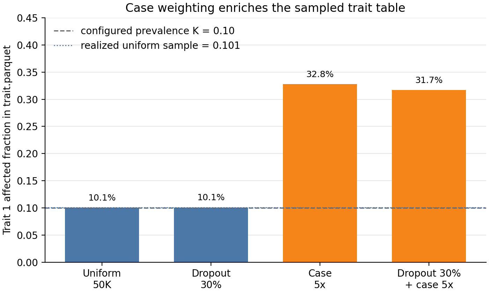
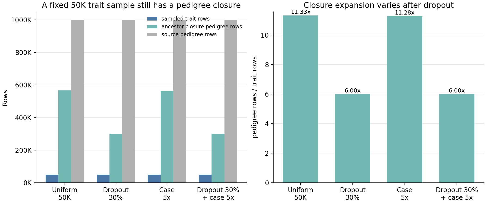
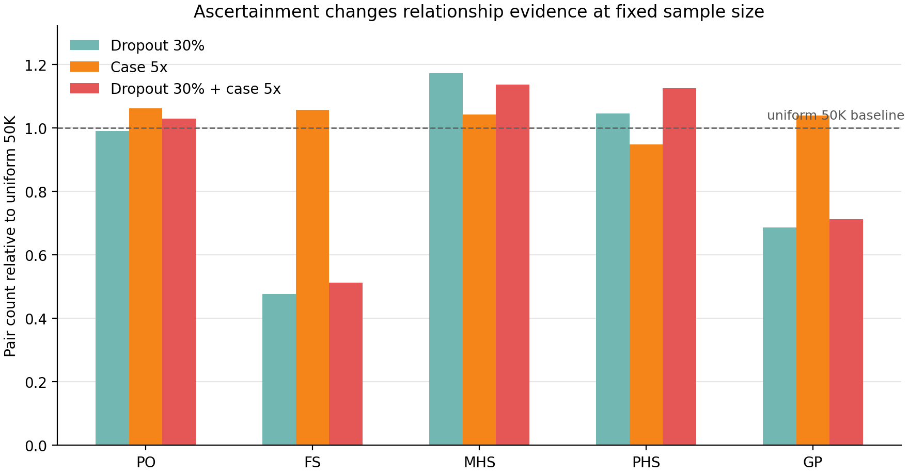

# When the study sample is not the population

Ascertainment runs after phenotype and censoring. It leaves the seeded source
population and its generated trait values intact, but changes which individuals
and relationships enter the analysis dataset. This example varies only the
ascertainment settings while holding the simulated pedigree, phenotype model,
and censoring windows fixed.

## Scenarios / Configuration

The scenarios are defined in `config/examples.yaml` under a shared YAML
anchor so the upstream simulation settings are identical.
All four scenarios use the same seed and a fixed target analysis sample size of
50,000 individuals.

| Scenario | `dropout_rate` | `case_ascertainment_ratio` | `N_sample` | Interpretation |
|---|---:|---:|---:|---|
| `ascertainment_uniform50k` | 0.0 | 1 | 50,000 | uniform 50K study sample |
| `ascertainment_dropout30_50k` | 0.3 | 1 | 50,000 | uniform 50K sample after random dropout |
| `ascertainment_case5x_50k` | 0.0 | 5 | 50,000 | affected individuals weighted 5× during sampling |
| `ascertainment_dropout30_case5x_50k` | 0.3 | 5 | 50,000 | dropout followed by 5× case-weighted sampling |

The shared configuration deliberately suppresses other mechanisms that could
obscure the ascertainment effect:

```yaml
seed: 70701
N: 100000
replicates: 1
G_sim: 10
G_ped: 10
G_pheno: 6
pedigree:
  trait1: {A: 0.5, C: 0.0, E: 0.5}
  trait2: {A: 0.5, C: 0.0, E: 0.5}
  rA: 0.0
  rC: 0.0
  rE: 0.0
phenotype:
  trait1: adult LTM, prevalence = 0.1
  trait2: adult LTM, prevalence = 0.1
censoring:
  gen_censoring: [0, 80] for every recorded generation
ascertainment:
  N_sample: 50000
```

The figures report **Trait 1**. Trait 2 mirrors Trait 1 so the required
two-trait simulation does not introduce cross-trait structure into this
example. Broad age-window censoring is used to isolate ascertainment; this page
is not a censoring example.

## Run

Generate the four scenario reports from the repository root:

```bash
snakemake --cores 4 \
  results/examples/ascertainment_uniform50k/rep1/stats_report.yaml \
  results/examples/ascertainment_dropout30_50k/rep1/stats_report.yaml \
  results/examples/ascertainment_case5x_50k/rep1/stats_report.yaml \
  results/examples/ascertainment_dropout30_case5x_50k/rep1/stats_report.yaml
```

Then regenerate the documentation figures:

```bash
python docs/examples/scripts/build_ascertainment_bias.py
```

## Observation 1 — Case weighting turns a 10% trait into an enriched study sample



The dashed grey line marks the configured Trait 1 prevalence, $K = 0.10$.
The dotted blue line marks the realized affected fraction in the uniform 50K
sample. Dropout alone is not trait-targeted, so it should stay close to the
uniform-sampling baseline. In contrast, `case_ascertainment_ratio: 5` gives
affected individuals five times the sampling weight of unaffected individuals,
so the final `trait.parquet` is intentionally case-enriched.

The affected fraction is measured in the sampled `trait.parquet` after
phenotype, censoring, and ascertainment. Small differences between the uniform
and dropout-only bars should not be overinterpreted because this example uses a
single seeded replicate for fast reproduction.

## Observation 2 — A fixed trait sample still produces different pedigree closures



Every scenario targets the same 50K analysis sample, so the sampled trait table
has the same intended size. The post-ascertainment `pedigree.parquet` is larger
because it contains the sampled IDs plus their ancestor closure within the
post-dropout pedigree. Dropout changes which ancestors remain recoverable, so
the closure expansion can differ even when the trait sample size is fixed.

This distinction is load-bearing for downstream methods: `trait.parquet` is the
analysis trait table, while `pedigree.parquet` is the pedigree context available
for relationship recovery.

## Observation 3 — Ascertainment changes which relationship evidence remains



The uniform 50K scenario is the reference line at 1.0. Bars below or above that
line show how many parent-offspring (`PO`), full-sibling (`FS`), maternal
half-sibling (`MHS`), paternal half-sibling (`PHS`), and grandparent (`GP`)
pairs remain relative to uniform sampling at the same target sample size.

Dropout can sever parent links and remove ancestors from the closure, which
especially affects relationship types that require intact pedigree paths.
Case-weighted sampling changes the composition of the 50K trait sample; even at
the same sample size, the relatives available to correlation and heritability
summaries are not guaranteed to match the uniform sample.

## Implications

- Treat the source population, sampled trait table, and ancestor-closure
  pedigree as different objects.
- `dropout_rate` is uniform random removal; it models incomplete recovery, not
  trait-dependent missingness.
- `case_ascertainment_ratio` affects sampling only when `N_sample > 0`.
- simACE exposes the bias induced by ascertainment; it does not correct
  downstream estimates automatically.

See the [ascertainment user guide](../user-guide/ascertainment.md) and
[ADR 0001](../adr/0001-unified-ascertainment-stage.md) for the stage semantics.
